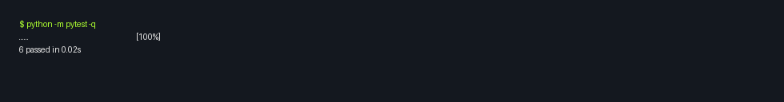

# 🎮 Game Glitch Investigator: The Impossible Guesser

## 🚨 The Situation

You asked an AI to build a simple "Number Guessing Game" using Streamlit.
It wrote the code, ran away, and now the game is unplayable. 

- You can't win.
- The hints lie to you.
- The secret number seems to have commitment issues.

## 🛠️ Setup

1. Install dependencies: `pip install -r requirements.txt`
2. Run the broken app: `python -m streamlit run app.py`

## 🕵️‍♂️ Your Mission

1. **Play the game.** Open the "Developer Debug Info" tab in the app to see the secret number. Try to win.
2. **Find the State Bug.** Why does the secret number change every time you click "Submit"? Ask ChatGPT: *"How do I keep a variable from resetting in Streamlit when I click a button?"*
3. **Fix the Logic.** The hints ("Higher/Lower") are wrong. Fix them.
4. **Refactor & Test.** - Move the logic into `logic_utils.py`.
   - Run `pytest` in your terminal.
   - Keep fixing until all tests pass!

## 📝 Document Your Experience

- [x] Describe the game's purpose.
   This game is a Streamlit-based number guessing challenge where the player selects a difficulty, submits guesses, gets higher/lower feedback, and tries to win within a limited number of attempts while tracking score and guess history.

- [x] Detail which bugs you found.
   The app had several gameplay and architecture issues: core logic functions in `logic_utils.py` were unimplemented, hint behavior became unreliable due to type mismatches between integer guesses and string secrets, and session-state flow caused unstable behavior across reruns (including inconsistent attempts/state resets).

- [x] Explain what fixes you applied.
   I implemented and centralized game logic in `logic_utils.py` (`get_range_for_difficulty`, `parse_guess`, `check_guess`, `update_score`), refactored `app.py` to import and use those functions, corrected secret/guess comparisons to use consistent types, fixed session-state handling for new games and difficulty changes, and validated the result by running tests until all passed.

## 📸 Demo

- [x] [winning](winning.png)

## ✅ Challenge 1: Advanced Edge-Case Testing

I added pytest coverage for three edge-case inputs that could break game logic:

1. Negative number input (`-5`): verifies parsing succeeds and gameplay logic returns `Too Low` without crashing.
2. Decimal input (`42.5`): verifies parsing rejects the value gracefully with a clear error message.
3. Extremely large value (`999999999999999999999999999999`): verifies parsing and comparison logic remain stable and return `Too High`.

Edge-case tests were added to [tests/test_game_logic.py](tests/test_game_logic.py) and all tests pass.

## 🚀 Stretch Features

- [ ] [If you choose to complete Challenge 4, insert a screenshot of your Enhanced Game UI here]
